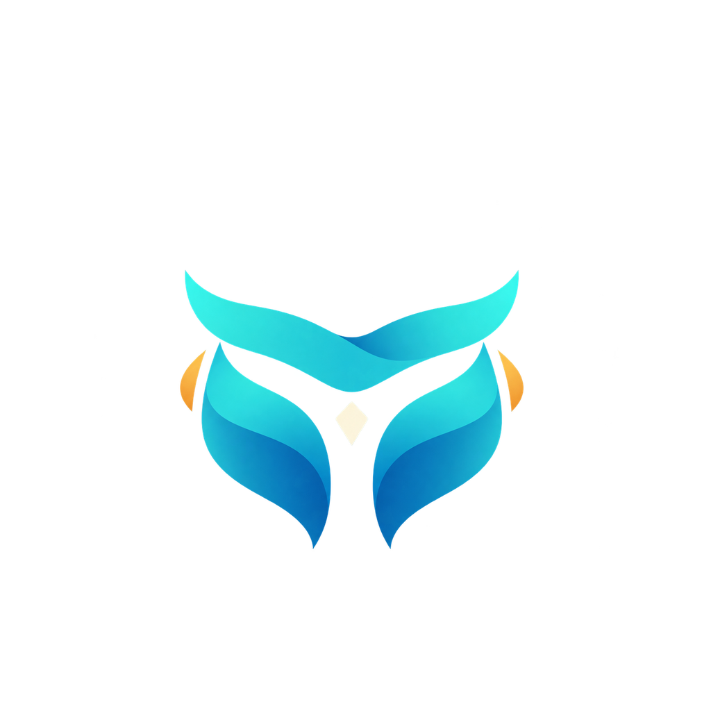
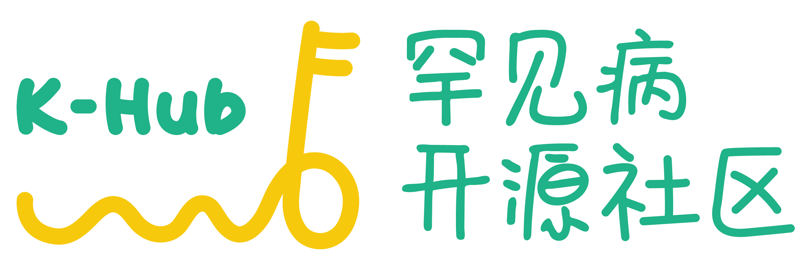

<p align="center">
  
  &nbsp;&nbsp;<strong>×</strong>&nbsp;&nbsp;
  <a href="https://www.openkhub.com/">
    
  </a>
</p>

<h1 align="center">听野 · SenseField</h1>

<p align="center"><strong>把视野之外的战局，交给耳朵和手。</strong></p>

<p align="center">
  <a href="LICENSE"></a>
  
  
</p>

<p align="center">
  罕见·无界黑客松参赛项目<br>
  赛题：为视力障碍玩家打造识别全屏地图的工具
</p>

---

**听野（SenseField）** 是面向视野狭窄和低视力玩家的 Android 实验原型。它尝试把游戏画面中玩家可能难以持续观察的信息，转译成空间音频、语音、触觉和高对比视觉线索，补充信息而不代替操作。

本项目由参赛团队独立开发，是非官方作品，与腾讯、天美工作室群及《王者荣耀》官方无隶属、合作或认可关系。相关名称、商标和游戏内容归各自权利人所有。

## 为什么做听野

对管状视野、低视力等玩家来说，放大屏幕会让同一时刻可见的范围更小，通用读屏软件又难以跟上实时对局。玩家需要的是在不遮挡仅存视野的前提下，及时感知屏幕边缘和小地图上已经出现的信息。

> **补信息，不添乱；做队友，不做代打。**

听野是一层无障碍信息转换：重新表达玩家本来能够看见、却可能无法持续观察或记住的事件。它不提供兵线计时、路线推荐、打龙建议等战术指挥，游戏判断和操作始终由玩家完成。

## 工作方式

```text
用户授权截屏 → 端侧识别关键事件 → 筛选、排序与去重 → 声音、触觉或视觉线索 → 玩家自主决策
```

- 屏幕画面只在用户授权后获取，并优先在设备本地处理。
- 只提示游戏界面中已经呈现、但可能处于玩家有效视野之外的信息。
- 通过事件确认、合并、冷却和优先级控制提示频率，减少信息过载。
- 工具不产生任何游戏输入，不帮玩家点击、走位或攻击。

## 使用边界

- 仅通过 Android `MediaProjection` 获取用户明确授权的屏幕画面；不读取游戏进程或内存。
- 不注入游戏、不模拟触控、不替玩家作战术判断。
- 私有录像、抽帧、标注数据和实验产物不纳入公开仓库。
- 这是尚未完成最终实体机与玩家验收的研究原型；实际使用前请核实游戏条款和赛事规则。

## 当前进度

| 能力 | 状态 | 说明 |
| --- | --- | --- |
| Android 屏幕采集 | 已实现实验链路 | Android 13/14 模拟器流程已验证；Android 14 首轮真机已跑通授权、横屏采集和提示播放，长时会话验收仍待完成。 |
| 小地图识别 | HD 实验候选；Android 首装默认关闭实验识别开关 | 当前候选已在本地开发 profile 中配置；严格跨运行时一致性和独立留出验证尚未通过。 |
| 视野记忆与提示 | 实验版，待复测 | 已接入事件跟踪和多通道提示。首轮真机反馈提示过频并出现方向误报，路由修复已完成，仍需真机复测和玩家体验验证。 |
| 最终验收 | 进行中 | 仍需完成独立对局、Android 实体机长时运行、端到端延迟测量和目标玩家评估。 |

当前 HD 候选的开发评估如下。置信度为 `0.67`、NMS 为 `0.5`，框匹配 IoU 阈值为 `0.5`。

| 评估集 | TP / FP / FN | 精确率 | 召回率 | F1 |
| --- | ---: | ---: | ---: | ---: |
| Android 同款 ncnn 开发验证集（230 张图、400 个真值框） | 353 / 15 / 47 | 95.92% | 88.25% | 91.93% |
| 跨来源开发诊断集（121 张图、211 个真值框） | 192 / 16 / 19 | 92.31% | 91.00% | 91.65% |

以上均为开发数据评估，不是独立盲测成绩；候选尚未通过严格跨运行时一致性检查，首轮真机反馈后的修复版也待复测。完整证据边界和待验证项见[当前验证状态](validation/STATUS.md)。

## 本地运行

Python 工具需要 Python 3.10 或更新版本；录像处理需要 FFmpeg。完整环境配置见[团队协作与本地运行](docs/团队协作与本地运行.md)。

```sh
python3 -m venv .venv
source .venv/bin/activate
python -m pip install -e '.[test]'
```

Android 应用可用 Android Studio 打开 `android/`，也可以运行：

```sh
cd android
./gradlew assembleDebug
```

首次原生构建会下载并校验项目锁定版本的 ncnn Android 依赖。

## 项目结构

| 目录 | 内容 |
| --- | --- |
| `android/` | Android 屏幕采集、事件处理与提示 |
| `native/` | C++ 视觉识别和事件逻辑 |
| `python/mapassist/` | 数据处理、回放、标注与评测工具 |
| `training/` | 模型训练与评估工具 |
| `profiles/` | 识别区域和参数配置 |
| `validation/` | 验证状态与实验记录 |

## 文档

| 主题 | 文档 |
| --- | --- |
| 赛题背景与用户问题 | [赛题背景](docs/赛题背景.md) |
| 产品和系统方案 | [技术方案](docs/技术方案.md)、[视野记忆设计](docs/视野记忆.md) |
| 端侧事件处理 | [事件感知与可靠性方案](docs/端侧事件感知与可靠性增强技术方案.md) |
| 开发与本地运行 | [团队协作与本地运行](docs/团队协作与本地运行.md)、[贡献指南](CONTRIBUTING.md) |
| 当前验证结论 | [验证状态](validation/STATUS.md) |
| 第三方依赖和许可 | [第三方声明](THIRD_PARTY_NOTICES.md) |

逐场录像、标注与历史实验文档保留在 `validation/` 中供需要时查阅，不逐项放在项目首页。

## 开源许可

本项目自有代码和材料按 [Apache License 2.0](LICENSE) 授权。第三方代码、模型、商标、游戏内容及其他引用材料遵循各自的权利和许可，详见[第三方声明](THIRD_PARTY_NOTICES.md)。
