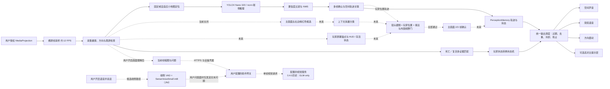

# 听野（SenseField）技术方案

> 参赛项目：面向低视力玩家的实时游戏信息无障碍转换层
> 文档版本：1.2
> 更新日期：2026-10-04
> 当前阶段：Android 实验原型；0.3.8 为最新公开体验版。0.4.1/code18 APK 已无线安装至小米 Android 14（214121822 bytes；SHA-256 `4218bf94b03153e48e9e313fd28900139c14c0bba000e534289cd4f799df5759`）；225 项 JVM、10 项 instrumentation、103 项 Python 网关以及 Debug/Test APK 与 lint 通过。端侧纯合成 PCM instrumentation 的比分/出装/选人三例耗时 170/294/352ms，关键词和 `isRequest` 断言通过；不是物理麦克风、实际发声、P95 或温升验证。最终 ASR 为 bundled SenseVoiceSmall int8 手机本地识别，已实现并装机。此前服务器 ASR WSS 合成对照 speech-end 至 final 单点 274ms 已属历史，仅供比较。此前 Mac 合成菜单路径使用 `qwen/qwen3.8-27b`；旧设备会话记录 11 个客户端 FINAL、其中 6 个为空，计数器另显示 2 个手动请求、8 个主动请求和 5 个 accepted results；其余状态未审计，不能完整归因。外部实声、热/负载与玩家验收仍待完成

## 1. 方案摘要

听野是一套运行在 Android 端的实时游戏信息无障碍转换系统。用户授权屏幕采集后，既有小地图事件识别在设备本地运行，并通过短音、语音、节奏震动和可选提示层重新表达信息。0.4.0 另提供默认关闭的语音和画面问答实验：用户分别开启后，语音片段或选中的当前帧会经其配置的 HTTPS 网关送往远端服务。该远端路径不替代本地事件识别。

本方案解决的不是“如何替玩家做出更好的战术决策”，而是：

> 如何把游戏界面已经向玩家展示、但因有效视野有限、注意力受限或认知负荷较高而难以持续感知的信息，及时、克制地转换到可感知通道。

系统不读取游戏内存，不注入游戏进程，不模拟触控，不执行移动、攻击或技能操作，也不输出“去打龙”“走哪一路”等策略指令。玩家始终保留判断权和操作权。

第一版 MVP 聚焦五类产品能力，主画面边缘候选单独作为离线诊断；其中前三类已经接入实验原型：

| 感知事件 | 输入信息 | 无障碍输出 | 当前状态 |
| --- | --- | --- | --- |
| 敌人出现 | 小地图敌方头像 | 一次中性短音、可选高对比标记 | 已实现实验版；标准模式不猜方向 |
| 敌人消失 | 头像由可见转为丢失 | 最后位置与移动方向残影 | 已实现实验版；标准模式静默 |
| 附近敌人（近区占用） | 小地图敌方头像相对自身标记的位置 | 一次声像短音 + “左上，敌人”；持续占用不重复 | 已实现实验版（双类 v6 512 profile）；R_enter 待标定，待真机与目标玩家验证 |
| 危险接近 | 敌我相对位置与接近速度 | 高优先级方向震动与短语音 | 接近速度、危险区域和交战状态均未实现，当前关闭 |
| 关键状态变化 | 死亡／复活固定 UI | 语音与触觉 | 软件链路已接入，真实签名与留出集待完成 |
| 主画面边缘候选 | 红色血条和其他边缘候选 | 仅作离线诊断 | 160 张已复核，默认关闭且不进入发布版 |

0.4.0 助手是独立的 opt-in 实验能力：ASR 在用户配置的网关运行；当时的视觉服务为 GLM-4.6V-Flash。0.4.1 网关支持服务端 `zhipu` 与 compatible API 提供商；按用户指定先测 MiniMax、再测 Qwen。当前明确选择的模型 ID 为 `qwen/qwen3.8-27b`，正确 ID 的合成读选项及 Mac→TLS 网关→Qwen 合成菜单读取通过；先前不带 namespace 的 HTTP 503 保留为历史，原因未知。MiniMax 较早的合成成功单点保留为历史，但近期 1024 与 thinking disabled/256 探针 HTTP200 空正文。模型间无自动 fallback；细节和未完成验收见[0.4.0 Goal](../../validation/assistant/GOAL_0.4.0_2026-10-03.md)与[真机记录](../../validation/assistant/ASSISTANT_LIVE_0.4.1_2026-10-04.md)。

## 2. 用户问题与设计原则

部分低视力玩家能够看清角色附近的中央区域，却难以同时观察屏幕边缘和小地图。普通的画面放大还会进一步缩小同一时刻可见的范围；传统读屏又难以跟上实时变化的图标和战局信息。

听野遵循五项设计原则：

1. **补信息，保留玩家决策权**：本地敌方提醒只表达可见事件，不替代操作；新助手实验在用户明确提问时，可解释装备并给购买建议、推荐英雄或分析对战策略。新 APK 已安装，但没有完成真实游戏画面或玩家验收；回答须区分截图事实与一般知识，不能自动操作游戏。
2. **少而关键**：识别到信息不等于立即打扰用户；重复、过时和低相关事件应被合并或静默。
3. **多通道重编码**：允许视觉、听觉和触觉互补，避免把全部信息挤进语音通道。
4. **本地优先、逐项授权**：小地图识别与最终方案中的 ASR 在本机运行；语音、画面和主动观察分别默认关闭。只有用户问画面时，识别文本问题和授权截图才发送给视觉网关；旧版服务器 ASR 对照路径不代表当前目标。
5. **证据边界清晰**：开发集、留出集、模拟器和实体机结论分别记录。当前 HD 候选首装默认启用仅用于开发试用，明确标记实验且可关闭，不代表通过验证或验收。

## 3. 产品技术边界

本地实时敌方提醒仍只重编码玩家可从画面获得的事件，不代替其操作。此前 0.4.0 选用式助手另采用“只读 HUD/菜单、不推断打法、不提供下一步建议”的保守设计；当前新 APK 已纳入独立的游戏知识助手实验：对显式问题，根据最近最多三帧截图和一般知识解释静态装备、给购买建议、在选人页推荐英雄、并分析对战策略。APK 安装与软件测试不表示该建议已通过真实游戏画面或玩家验收。

新助手需求仍以用户授权、手动提问、可见截图和一般游戏知识为基础：最多带两张不超过 6 秒的 640 尺寸缓存图及一张 1280 尺寸主图；保持原问题，不改写；服务端维持 `hud` / `ui_text` / `unknown` 分类，不添加 kind；回答最多两句且不超过 100 个汉字。不可声称截图中未出现的敌方位置、隐藏状态或技能冷却，也不读取游戏进程/API、不注入、不自动操作。装备强度可能受版本影响，不承诺当前版本的数值或强度；外部游戏条款和赛事要求仍需核对。该用户请求不证明模型准确率、玩家帮助、公平性或符合度得分。

视野记忆（Vision Memory）保存敌人头像从出现到消失期间的最后位置、最后移动方向和消失时间，使用户不必持续注视或记忆小地图。该能力属于界面信息的无障碍重编码，不扩展玩家可获取的信息边界。

## 4. 总体技术架构



虚线表示按用户授权运行的助手/候选路径。手机端 bundled SenseVoiceSmall int8 已在本轮 APK 安装；一项纯合成 PCM instrumentation 覆盖比分、出装和选人问题并通过关键词、`isRequest` 断言。只有用户问画面时，识别出的文本问题和授权截图才会送往视觉网关，语音音频不联网、不落盘。服务器 Paraformer/SenseVoice WSS 为历史对照实验，网关当前 `vision_only` / `asr_ready=false`，不加载服务器 ASR 模型。该合成测试不验证麦克风识别、物理声音、P95 或温升。主画面候选必须顺序通过语义、玩家状态、镜头关系、距离／外围视野、时序确认和统一仲裁，不能绕过任一门直接发声。

系统由六个核心层组成：

### 4.1 屏幕采集层

- 使用 Android `MediaProjection`，每次会话均由用户主动授权整个屏幕。
- 前台服务管理采集生命周期，支持开始、暂停、恢复、停止和系统撤销授权。
- 通过 `ImageReader` 接收 RGBA 帧，以约 12 FPS 采样，避免按屏幕刷新率重复推理。
- 仅处理横屏画面；连续黑屏会停止采集，防止对受保护或不可用内容空转。
- 屏幕旋转和采集尺寸变化会重建读取器并重置事件状态，避免产生伪“敌人消失”。
- `MediaProjection.Callback.onStop()` 将当前授权标为撤销并停止服务；不会自动恢复，也不会复用旧授权，用户需重新发起系统授权流程。助手上传画面另需在设置中明确开启。

### 4.2 小地图定位层

当前稳定路径使用配置文件中的固定归一化 ROI。实验性自适应定位器使用：

- 黑边内容区归一化；
- 相对短边的布局锚点；
- 位置、缩放和宽高比搜索；
- 两帧确认、短时保持和周期重定位；
- 粗略布局框与定位框并集修正，降低边缘目标被裁掉的风险。

自适应定位已完成离线链路验证，但会改变旧检测模型的裁剪分布，因此未作为 APK 默认路径。

### 4.3 视觉识别层

小地图敌方头像使用单类 YOLOX Nano 320 模型：

- 输入：小地图 RGBA 裁剪；
- 预处理：RGBA 转 BGR、等比例缩放至 `320×320`、右侧和下侧填充 114；
- 推理：ncnn Android 静态运行时，CPU 两线程；
- 解码：strides `8/16/32`，`objectness × class`；
- 旧固定 ROI 候选阈值（低清历史，已退役）：confidence `0.19`，NMS IoU `0.5`；
- 输出：敌方头像框、置信度、时间戳和相对方位。

模型在 Android JNI 中直接完成裁剪、推理、解码和坐标还原，避免把完整帧复制到 Java 层。

主画面边缘分支与小地图模型分开治理。当前 160 张人工复核样本（47 张 `corrected`、113 张 `negative`、114 个框）及完成审计文件 `data/private/main-edge-review-v1/review-batch-v1/review-completion-audit.json` 只用于红色候选／困难负样本诊断，不能作为 `enemy hero` 真值：小兵、野怪可能有相似血条，镜头也可能漂移。该分支默认关闭，发布版不启用。

后续主画面分支采用共享证据链，不把每种证据都实现成独立重模型：

```text
左右边缘红色候选
    ↓ 批量裁出候选周围上下文
轻量多类分类：敌方英雄 / 兵野怪 / UI特效 / 不确定
    ↓
玩家屏幕锚点 + HUD/存活状态 + 小地图玩家轨迹
    ↓
镜头跟随关系 + 敌我接近 + 外围视野判定
    ↓
2/3 帧确认 → PerceptionMemory → CueArbiter
```

候选生成只负责提高召回；上下文分类和相关性门负责阻止误报。玩家屏幕锚点优先使用同一主画面特征提取和固定 HUD 规则，候选可合批推理，避免再并行运行一套完整全屏 YOLOX。若端侧性能实测仍不达标，再把候选分类与玩家锚点改为共享编码器的多任务模型。

### 4.4 事件引擎层

单帧检测结果不能直接触发提示。原生 C++ 事件引擎负责：

- 置信度门限；
- 过期观察丢弃；
- `2/3` 帧确认；
- 最近邻空间轨迹关联；
- 全局提示间隔和同类冷却；
- 高优先级事件抢占；
- 采样中断时状态重置。

主流程只传递结构化事件，不保存屏幕图像。

### 4.5 相关性过滤层

无障碍系统不能“识别到就播报”，否则过量提示本身会成为新的障碍。当前原型采用可验证的保守过滤：

- 视觉标记必须通过置信度与连续帧确认；
- 小地图只在稳定 APPEAR 时产生一次声音候选，TRACK 与 DISAPPEAR 保持静默；
- 玩家位置不可靠时不编码小地图中心方向，只播放中性短音；
- 标准模式不对小地图视觉记忆使用语音和触觉；
- 同类小地图声音设置独立冷却，较高优先级事件可以抢占低优先级事件；
- 过期事件不播放，即使音频资源稍后才加载完成。

完整的“危险接近”相关性评分需要我方位置、敌我距离、接近速度、危险区域、交战状态、用户偏好和信息新鲜度：

```text
relevance = 距离 × 接近速度 × 危险区域 × 交战状态 × 用户偏好 × 新鲜度
```

双类实验 profile 已能识别自身小地图标记，并据此实现了“近区占用”事件：只陈述“有敌方标记进入你附近的某个方位”，不计算接近速度、危险区域或交战状态，也不说“危险”。它以小地图自身标记为原点，与主画面镜头无关，因此不需要镜头跟随门。完整的危险接近评分仍未实现，保持关闭；系统不会仅因检测到敌方英雄或打野就发出全局危险提醒。规格见 `docs/plans/黑客松方案收敛与实施路线.md` 第 4 节。

主画面边缘候选若要进入产品事件流，还必须先通过上下文英雄分类和玩家相关性门。上下文分类使用候选框周围的角色、等级和血条结构，至少区分敌方英雄、兵／野怪、UI／特效和不确定目标；单独的红色横条不能触发事件。不确定目标始终静默，只作为下一轮困难样本。

镜头跟随不依赖常驻的镜头按钮，而以中央玩法区的 `player_screen_anchor` 为主要证据：检测自己的绿色血条及等级／名字组合，要求 250 ms 内更新且位于配置的跟随带。小地图玩家位置 500 ms 内更新时可作为辅助证据，并用于敌我接近关系。玩家屏幕锚点、HUD、存活状态、敌我接近或镜头关系任一不可靠时，立即清空主画面 track 并保持静默；小地图视觉记忆继续运行。候选进入用户可见的中央区域或已靠近玩家锚点时也不提示，避免重复表达玩家已经能看见的信息。

### 4.6 无障碍输出层

- **声音**：小地图 APPEAR 在标准模式只播放一次中性短音；近区事件可使用左右声像短音。实验性空间处理是合成立体声、声像、短时差和简化频谱整形，不是 HRTF，也不提供已验证的上下辨位或三声源并行。主画面左右边缘分支仍关闭。
- **事件语音**：标准模式关闭小地图语音；详细模式以后可播报“发现新的敌方头像”，但玩家位置不可靠时不添加方位。
- **方向震动**：当前通过不同节奏表达部分方向类别，使用 Android 默认振动器，不驱动左/右独立马达。近区距离强度选项默认关闭；有振幅控制时调节幅度，否则调节时长。API 调用日志只证明已请求系统震动，不证明玩家实际感知。
- **高对比提示层**：红色圆环表示当前可见目标；进入 DISAPPEAR 后，消失目标显示最后位置、斜线和移动箭头，在 4 秒内渐隐。
- 提示层使用 `TYPE_APPLICATION_OVERLAY`，不获取焦点、不接收触控，并设置安全窗口标记；不同设备是否能完全从 MediaProjection 中排除仍需实体机确认。

### 4.7 玩家状态与采集可靠性

- 死亡／复活使用 dHash、亮度结构和色彩摘要共同判断，并以 `2/3` 帧确认状态转换；证据冲突时保持 UNKNOWN。
- 初次建立 ALIVE 状态不播报，只有确认死亡和死亡后的确认复活各提示一次。
- MediaProjection 帧断流与持续黑屏分开处理；断流只重建 ImageReader 和 Surface，采用 0.5、1、2 秒有限恢复，不申请 AccessibilityService。
- 所有输出经统一 `CueDispatcher` 处理，支持精简、标准、详细三个预设以及通道／类别高级开关。
- 详细接口、配置与门禁见 `docs/design/端侧事件感知与可靠性增强技术方案.md`。

### 4.8 选用式语音与画面助手（0.4.0起，0.4.1实验修订）

- 0.4.0 历史配置的视觉后端仅为 GLM-4.6V-Flash。当前 0.4.1 服务端可配置 `zhipu` 或 compatible API；当前明确选择 `qwen/qwen3.8-27b`、`max_tokens=256`，正确 ID 的直接合成和 Mac→TLS 网关合成菜单请求读出选项并通过所有权核对。MiniMax-M3 近期探针为 HTTP200 空正文；更早成功单点标记为历史结果。先前不带 namespace 的 503 不能用来推断全部原因，不自动回退其他模型。
- 语音、画面理解分别默认关闭；低频主动观察还需单独开启。设置中说明所选数据传输后，运行期间才启动对应路径。用户选择持续语音与插话能力；助手随用户启动的屏幕采集会话运行，不建立独立的后台常听服务，也不强制把持续语音改成按住说话。
- 本地 ASR 由 `AudioRecord` 采音，使用端侧 WebRTC VAD 2.0.10（aggressiveness mode 3）和 bundled SenseVoiceSmall int8 模型，经 JNI sherpa-onnx 1.13.8 / ONNX Runtime 1.28.2 单线程 CPU 运行；约 239 MB 权重作为 APK asset，启动时本地复制并校验哈希。目标最低 Android 10，不依赖系统 on-device service。当前 0.4.1/code18 APK 已装机，纯合成 PCM instrumentation 对比分/出装/选人三例通过，耗时 170/294/352ms，预设关键词和 `isRequest` 断言通过。音频不联网、不落盘；只在用户问画面时将识别文本问题与授权截图发送到视觉网关；取消时保留单 slot 直到 native 调用退出，设备 HOT 时暂停输入，无云端 fallback。模型 asset 可随 APK 分发但不入 Git，随包注明 FunASR Model License 1.1、Sherpa Apache-2.0 与 ONNX Runtime MIT。服务器 ASR WSS speech-end 至 final 的 274ms 仅作历史合成对照单点，不是端侧 ASR、物理麦克风端到端时延或 P95。实际麦克风、声音、温升和设备路由体验仍待目标门禁验证。Android 10/API 29+ 使用本应用的静音 `AudioTrack` 探测默认 `USAGE_GAME` 路由，并以 `getRoutedDevice()` 与 routing callback 确认有线/USB 耳机；BLE 路由类型仅从 API 31 起可识别。探测轨道使用 `MODE_STATIC` 全零 PCM 短缓冲无限循环，不申请 audio focus、不调用 `setPreferredDevice()`，只报告本应用这条默认用途轨道的路由。它无法确认游戏是否为自己的轨道指定了不同设备，所以试用前须由用户确认游戏声已在耳机中；这项试验仍不开放外放场景。0.4.1增加普通A2DP耳机实验；设备类型无法区分蓝牙耳机与蓝牙音箱，用户须戴耳机并确认游戏声在耳机中。SCO、扬声器、无耳机、未知路由或探测失败仍暂停本地 ASR 输入。探测轨道完全静音，但可能带来额外 native 音频负载，需通过热/负载对照实测，不能称为零开销。
- Android 14/15 AOSP 会把发给普通非系统客户端的活动播放配置匿名化，并清空设备 ID；因此 `AudioManager.getActivePlaybackConfigurations()` 不能作为读取其他 UID 游戏实际输出路由的可靠门禁。AOSP 源码可追查：[Android 14 `PlaybackActivityMonitor`](https://android.googlesource.com/platform/frameworks/base/+/android-14.0.0_r1/services/core/java/com/android/server/audio/PlaybackActivityMonitor.java#L741)、[Android 15 `PlaybackActivityMonitor`](https://android.googlesource.com/platform/frameworks/base/+/android-15.0.0_r1/services/core/java/com/android/server/audio/PlaybackActivityMonitor.java#L791)、[Android 14 `AudioPlaybackConfiguration`](https://android.googlesource.com/platform/frameworks/base/+/android-14.0.0_r1/media/java/android/media/AudioPlaybackConfiguration.java#L391)。普通应用的新方案仅读取自己 `AudioTrack` 的路由；对应 AOSP 接口在 [`AudioTrack.getRoutedDevice()`](https://android.googlesource.com/platform/frameworks/base/+/android-14.0.0_r1/media/java/android/media/AudioTrack.java#L3786) 和 [`AudioRouting` 路由回调](https://android.googlesource.com/platform/frameworks/base/+/android-14.0.0_r1/media/java/android/media/AudioRouting.java#L52)。
- 录音端仍监测本客户端的 `isClientSilenced()` 及全局其他录音会话；自身被系统静音、出现其他麦克风活动、未知路由或设备探测失败时暂停本地 ASR 输入。安全条件恢复后清空旧轮次再继续，并保留独立本地预警。
- SpeexDSP AEC 已集成到耳机条件下的语音链路，回声参考仅取助手自己合成播放的 PCM；代码没有使用 `MediaProjection` playback capture 采集游戏声音，也没有接入系统 `VOICE_COMMUNICATION` AEC。算法实现已接入，目标设备上的实际抑制效果和并发录音仍须实测。
- 0.4.0 历史配置与旧候选只读取可见 HUD/菜单文字。新 APK 已纳入用户手动提问下的游戏知识问答实验：静态装备页解释与购买建议、选人页英雄推荐、对战策略分析；输入保留原问题，最多附两张 640 尺寸历史图和一张主图，动态 HUD 新鲜度窗口为 5 秒、静态界面为 15 秒，回答最多两句且不超过 100 个字符。该路径依赖用户授权的可见截图与一般游戏知识，区分截图事实和推断，不宣称隐藏状态或冷却。APK 已安装，但真实游戏画面和玩家评估未完成。此前 Qwen 合成结果只覆盖合成图与 Mac 网关请求；MiniMax 近期空正文和较早成功单点分别记录，不自动 fallback；均不是 Android 实际发声或 P95，也不等于本地 OCR。
- 现有“选哪个/哪一项？”请求可转读当前画面中清晰可见的选项名称；普通选择陈述不会因此发出截图请求。其已测窄行为是现状记录，用户新要求扩展为可回答购买、选人和战局分析问题，不把旧提示的“不推荐”设为永久边界。
- 蓝牙路由或麦克风安全状态处于阻塞时，本地状态不会被服务端 `ready` 覆盖；阻塞与恢复都会刷新运行通知。安全审计 `INPUT_STATE` 只记录 flags 和 routed device type，不记录转写正文。
- 13:37:53 的音频系统历史记录显示 A2DP 断开后路由回到扬声器，SCO 未启用。该路由记录不能证明用户某句话发生于该时刻。
- 助手失败、断网、暂停、过期、画面过热或投影撤销时，丢弃旧轮次内容，独立小地图预警继续工作。回答通过 session/turn/generation/frame ID 复核，TTS 回调只作诊断。
- 画面服务商数据用途和保留期限、部署网关/代理日志尚未审核。网关/客户端实现未做对话数据库存档，不等于整条路径零留存。部署前按实际账户条款与主机日志核对。
- 助手接口与验收口径见[0.4.0 Goal](../../validation/assistant/GOAL_0.4.0_2026-10-03.md)；当前0.4.1修订与未测部分见[真机记录](../../validation/assistant/ASSISTANT_LIVE_0.4.1_2026-10-04.md)。

## 5. 核心能力：视野记忆

视野记忆把瞬时检测转换成可持续、可解释的事件历史。

```text
候选目标
   │ 三帧中至少命中两帧
   ▼
APPEAR ──持续检测──▶ TRACK
                         │ 连续丢失三帧
                         ▼
                    DISAPPEAR
                         │
                         ├─ 最后位置
                         ├─ 最后速度向量
                         └─ LAST_DIRECTION 残影 4 秒
```

关键实现规则：

1. 目标中心点使用最近邻距离关联到最多 8 条轨迹。
2. 位置、框尺寸和速度使用指数平滑，降低检测框抖动。
3. 小于归一化阈值的位移视为检测抖动，不输出移动方向。
4. 连续漏检 1～2 帧仍保持可见状态，防止头像特效或压缩噪声造成闪烁。
5. 第 3 个连续漏检帧产生一次 DISAPPEAR 事件；后续残影刷新不重复播报。
6. 确认进入 DISAPPEAR 后，最后位置保留 4 秒并按时间逐渐降低透明度；确认丢失前的短暂漏检不消耗这段时间。
7. 暂停、旋转或采样长时间中断直接清空轨迹，不把技术中断解释成游戏事件。
8. 自适应小地图定位器处于 SEARCHING 时静默清空小地图轨迹；定位重新确认后再建立轨迹，不把 ROI 暂时不可用解释成敌人消失。
9. 目标进入 DISAPPEAR 后在残影期内重新出现时，清除旧移动向量与播报状态，并重新通过 `2/3` 帧确认后产生新的 APPEAR 候选；是否发声继续受会话级至少 15 秒间隔约束。
10. DISAPPEAR 只更新残影，标准模式不发声；同一稳定目标保持 30 秒不得重复提示。

## 6. 数据与模型流程

### 6.1 数据治理

- 私有录像、抽帧、标签和实验产物由 `.gitignore` 排除，不进入公开仓库。
- 数据按整场对局划分 train / validation / test，禁止同一录像跨分组。
- 标注工具支持多人领取、租约、乐观锁、框编辑、负样本和非对局画面排除。
- 独立留出抽样不读取模型预测，避免按预测结果挑选容易样本。

### 6.2 训练与转换

```text
授权录像 → 预测无关抽样 → 人工框标注 → COCO 导出
       → YOLOX Nano 训练 → 冻结权重 → ONNX / ncnn 转换
       → TorchScript / ncnn 数值一致性检查 → APK 资产哈希校验
```

模型文件、ncnn 依赖包、APK 内 profile 和离线预测均记录 SHA-256。构建阶段会校验模型资产，验收门禁会再次核对安装 APK 与离线评测是否使用同一配置。

## 7. 当前验证结果与证据边界

以下数据用于说明当前技术状态，不代表产品已经通过最终验收：

| 验证项 | 当前结果 | 结论 |
| --- | --- | --- |
| YOLOX Nano 320 开发验证 | precision 90.50%、recall 72.65%、F1 80.60% | 开发集召回未达 80%目标 |
| video7 人机局盲测 | precision 65.57%、recall 63.49%、F1 64.52% | 未通过发布门禁 |
| video8 旧冻结运行（ROI 截断污染的历史 crop-relative 数值） | 旧流程记录 precision 58.84%、recall 80.47%、方向准确率 96.86% | 固定 ROI 截断右侧目标；数值只对应不完整旧裁剪，不能作为完整地图效果或召回结论；需新留出数据 |
| 固定模型到 ncnn 一致性 | 30 张裁剪最大原始输出误差 0.0004493 | 低于 0.0005 门限 |
| Android 13/14 模拟器 | 截屏、横屏采集、ncnn 推理、暂停／恢复／停止均跑通 | 不能替代实体机发声、发热和功耗测试 |
| 当前 Android 构建 | `assembleDebug` 与 `lintDebug` 通过 | 代码和资源可生成 debug APK |
| 视野记忆状态机 | APPEAR、保持、DISAPPEAR、4 秒清除单元测试通过 | 尚需真实对局事件级标注和用户测试 |
| 近区关系层 | 18 个原生合成场景、Python ctypes 与 JVM 测试通过；video11 离线回放覆盖率 91.17%、近区提示 2.26 次／分钟 | video11 参与过选模，只是开发诊断；提示 precision／recall 尚未人工复核，R_enter 尚未标定 |
| 0.4.0 历史助手验证 | 当时合并树 204 项 JVM、12 项本地 Android 14 arm64 instrumentation、额外 2 项真实 HTTPS/WSS 合成输入测试、530 项 Python（1 跳过）及 native 4/4 通过；Debug 构建/lint 通过 | GLM 合成图、正式 Android 客户端与固定 CPU ASR 联调通过；这些是 0.4.0 历史工程结果，不代表已发布或当前物理门禁通过 |
| 0.4.1 交互与视觉验证 | 旧候选 Android JVM 216 项及 Android 14 `AssistantControls` 9/9 通过；本轮 0.4.1/code18 APK 已无线装至小米 Android 14，225 项 JVM、10 项 instrumentation、103 项 Python 网关、Debug/Test APK 与 lint 通过。新增本地 ASR 纯合成 PCM instrumentation 覆盖比分/出装/选人，170/294/352ms，关键词及 `isRequest` 断言通过。服务器 ASR WSS 对照 speech-end 至 final 的 274ms 为历史单点。14:27:32 旧会话 FINAL `requestLike=true` 后进入手动 QUESTION 与新帧请求；Qwen 合成视觉菜单往返 1350ms；MiniMax 最近两探针 HTTP200 但正文为空 | 本地 ASR 候选已安装并通过合成输入测试；上述结果不代表真实麦克风、实际可闻声音、P95、热/温升、玩家帮助或符合度得分。历史手机会话中 11 个客户端 FINAL 有 6 个为空，计数器另有 2 个手动请求、8 个主动请求、5 个 accepted results，其余状态未审计，不能完整归因。服务器当前 `vision_only` / `asr_ready=false`，ASR 已停用且不加载模型 |

发布目标门禁为：逐类 precision ≥90%、recall ≥80%、方向准确率 ≥90%，实体 Android 13/14 连续运行至少 15 分钟，实际发声端到端 P95 ≤250 ms。当前 HD 候选仍未通过严格跨运行时一致性和独立留出验证；为便于试用，开发 APK 内置启用候选的 profile，首装默认启用实验识别和新头像提醒。主画面边缘分支保持默认关闭且不进入发布版。模型权重不在 Git 中，只有放入匹配的本地 assets 后才能运行；设置中可关闭两项功能。

## 8. 性能设计

为控制耗电、发热和游戏帧率影响，原型采用以下措施：

- 推理区域限制在小地图 ROI，不对完整屏幕运行大模型；
- 本地小地图事件判定不依赖网络或多模态模型；只有用户分别开启助手后，显式问题或单独授权的低频观察才可把当前帧送往远端读取可见界面文字。网络结果不进入 250 ms 小地图发布门禁，也不能作为实时事件真值；
- 使用 Nano 级单类检测器与固定 `320×320` 输入；
- 采样约 12 FPS，而不是跟随 60/90/120 Hz 屏幕刷新率；
- ncnn CPU 两线程，关闭 Vulkan 和 FP16 实验路径，优先保证设备兼容与可复现性；
- Java 层不复制完整画面，JNI 直接读取 `ImageReader` 的直接缓冲区；
- 声音资源异步加载，事件过期后不补播；
- Overlay 只绘制少量矢量图形，不保存历史截图。

实体机验收需记录：持续处理帧率、最大帧间隔、端到端提示延迟、游戏帧率变化、电量变化和设备温度；所有结论均以听野自身测量为准。

## 9. 隐私、安全与公平边界

1. 仅使用 Android 官方截屏授权，不申请读取游戏进程或无障碍点击权限。
2. 小地图目标检测、轨迹、近区关系和本地命令在设备运行；这条本地识别路径不依赖远端图像服务。诊断截图若开启，单独按诊断功能的本地保留设置管理。
3. 助手语音和画面理解分别默认关闭、分别确认；本轮 0.4.1/code18 APK 已安装 bundled SenseVoiceSmall int8 手机 ASR（Android 10+、JNI sherpa-onnx 1.13.8 / ONNX Runtime 1.28.2 单线程 CPU、约 239 MB asset 本地复制校验）。手机 synthetic PCM instrumentation 对比分/出装/选人三例为 170/294/352ms，关键词和 `isRequest` 断言通过；不代表物理麦克风、实际发声、P95 或温升。当前音频在本机处理，不联网、不落盘；取消等待 native 退出、HOT 时暂停输入、不云端 fallback。网关 `vision_only` 模式关闭服务器 ASR，不加载其模型；服务器 ASR 274ms 合成 WSS 为历史对照单点。只有用户问画面时才发送文本问题和授权截图。0.4.0 画面路径由网关转交 GLM-4.6V-Flash；当前 0.4.1 网关支持服务端 `zhipu` 与 compatible API，当前选择 `qwen/qwen3.8-27b`。本轮合成视觉、ASR 对照、MiniMax 探针与旧会话触发链的范围见[Goal 记录](../../validation/assistant/GOAL_0.4.0_2026-10-03.md)与[真机记录](../../validation/assistant/ASSISTANT_LIVE_0.4.1_2026-10-04.md)。用户的新游戏知识助手实验范围是手动问答下的装备购买建议、英雄推荐和对战策略；低频主动观察还需单独开启。
4. 助手建议基于用户问题、最近授权截图与一般知识；只允许最多两张最近≤6秒的640尺寸缓存图及一张1280尺寸主图，原问题保持不改写，输出使用既有 `hud` / `ui_text` / `unknown` kind，最多两句、总计≤100个汉字。不要把一般知识写成已核实的当前版本装备数值；未在截图中可见的敌人位置、隐藏状态和技能冷却应回答未知，不从游戏内存或 API 获取。
5. 客户端仅接受 HTTPS 地址；视觉提供商凭据只放服务端环境。网关、代理和服务商的日志/数据留存条款尚未完成实测审计，不能承诺整个端到端路径零留存或屏幕内容不出设备。
6. 助手会话历史只留在内存；诊断包是独立的本地存储功能；模型上游日志与应用临时 TTS cache 分别核查。
7. 不注入、不改包、不读内存、不模拟触控，不产生任何游戏操作。
8. 助手可结合用户授权的可见截图和一般游戏知识回答显式问题；不得把未显示的敌人位置、隐藏状态或技能冷却说成已知事实，也不得从游戏内存/API获取信息。
9. 开发 APK 首装默认启用 HD 实验识别器和新头像提醒；用户可在设置中关闭。未通过严格 parity、独立留出和实体机验收前，候选仍标为实验，不视作发布版本。
10. 实际使用前需要确认游戏厂商服务条款、赛事规则及辅助功能允许范围。
11. 研究录像与标注必须获得授权，公开仓库仅保留代码、脱敏文档、示例 schema 及获准公开的模型资产。

## 10. 技术创新点

### 10.1 从单帧识别转向事件记忆

系统不是简单框出头像，而是维护出现、移动、消失和最后方向，使瞬时信息能够被低视力玩家持续感知。

### 10.2 从“识别即提醒”转向克制的事件过滤

多帧确认、轨迹去重、过期丢弃、冷却和优先级共同决定是否打扰用户。缺少敌我距离等关键证据时宁可静默，不用固定规则伪造危险判断。

### 10.3 同一事件的多模态可替换表达

视觉、声音和触觉承载不同信息：视觉保留历史；只有方向证据可靠时声音才表达方位；语音解释少量高价值状态变化；触觉用于不占据听觉通道的短促提醒。后续可以按用户需求关闭任一通道。

### 10.4 可审计的端侧验证链路

从数据分组、模型哈希、APK 资产到真机 `CueEvent` 日志和外部录音均可关联，避免用开发集成绩、模拟器结果或不同模型替代最终验收证据。

## 11. 风险与应对

| 风险 | 影响 | 当前应对 |
| --- | --- | --- |
| 小地图误报较高 | 错误提示增加认知负担 | HD 开发 APK 首装默认运行实验候选与新头像提醒；保留设置中的关闭项、15 秒提示冷却和轨迹确认，继续复测修复后的路由并扩充困难负样本、完成新留出对局验证 |
| 不同分辨率和刘海／黑边 | ROI 偏移或漏检 | 归一化配置；自适应定位器；旋转后重置 |
| 短时漏检造成闪烁 | 频繁出现／消失 | `2/3` 帧确认与连续三帧丢失判定 |
| 提示过量 | 遮挡游戏声音和队伍交流 | 小地图标准模式仅保留 APPEAR 中性短音、会话级至少 15 秒间隔、统一优先级和静默降级 |
| Overlay 被二次截取 | 影响下一帧识别 | 安全窗口标记；矢量样式与检测目标解耦；实体机验证 |
| 持续推理造成耗电与发热 | 影响游戏体验 | ROI 推理、12 FPS、Nano 模型、两线程；15 分钟真机测量 |
| 被误解为竞技外挂 | 合规与传播风险 | 不读内存、不控制游戏、不做策略建议；清晰公开能力边界 |

## 12. 现场演示流程

现场 Demo 只展示当前实现的近区闭环（与 `docs/plans/黑客松方案收敛与实施路线.md` 第 9 节一致）：

1. 目标玩家授权截屏，确认提示含义，选择通道。
2. 远处有敌方标记：静默。
3. 敌方进入近区：从对应方向传来短音和“左上，敌人”；持续存在不重播。
4. 敌方确认消失后再在近区出现：连续可靠缺席3秒才确认消失；确认后返回经新2/3识别再提示，其他敌方持续在附近也不阻止。短漏检及邻近换号保持已提醒状态，持续可见但仅进出范围不重播。当前暂定半径从0.20/0.25收紧到0.16/0.20，尚未独立标定。
5. 按住小地图或自身定位失效：一声低音，不说“安全”；恢复时一声柔和音。
6. 一键暂停，提示停止；展示实际日志和失败案例。

给评委看“雷达看到了什么”时，用回放画面或调试 overlay，和目标玩家听到的声音分开展示。小地图 DISAPPEAR 仍只更新残影、不播报。Demo 需要同时说明：识别器与近区半径仍处于实验阶段；演示证明交互闭环成立，不等于准确率、功耗和实体机最终门禁已经通过。

## 13. 后续计划

### 第一阶段：完成视野记忆验收

- 在新的、未参与调参的真人对局上做逐帧与事件级盲测；
- 降低小地图误报并冻结新模型；
- Android 13/14 实体机各完成至少 15 分钟连续运行；
- 测量延迟、游戏帧率、温度、电量与实际发声；
- 邀请目标用户验证提示清晰度、认知负担和通道偏好。

### 第二阶段：实现危险接近

近区占用事件已作为实验功能实现（自身标记检测、敌我相对距离、8 向方位）；以下仍是完整危险评分所需的后续工作。

- 在独立对局上验证自身标记检测与近区提示；
- 计算敌我相对距离和接近速度；
- 要求玩家小地图位置新鲜度 ≤500 ms；镜头跟随只在主画面分支中才需要；
- 标注危险区域和交战状态；
- 通过用户可调阈值实现 relevance score；
- 未取得完整输入时保持静默；主画面红色候选还必须先通过上下文英雄分类。

### 第三阶段：验收死亡／复活关键状态

- 使用授权录像生成私有死亡／存活签名并冻结阈值；
- 在独立完整对局上验证事件 precision、recall 和转换延迟；
- 完成 Android 13/14 断流恢复、功耗、温度和游戏帧率测量；
- 门禁通过后再评估血量和技能冷却，不把单一 UI 参数误称为通用方案。

### 独立实验阶段：0.4.0 选用式助手

- 完成网关与 Android 客户端 HTTPS/WSS、设备凭据、取消/过期、断网降级、投影 `onStop` 和权限撤销的真机检查。
- 分别验证语音、画面和低频主动观察开关；记录 ASR `asr_ms`、配置的视觉提供商 `elapsed_ms` 与外部实声延迟，不混为同一项指标。0.4.0 的 GLM 测量只作历史记录。
- 外部录像按 session/turn/audio ID 标注说话起点、说话结束、实际静音、被打断音频停止和首段有用回答；用 `python -m mapassist.measure_assistant_latency` 汇总配对 P50/P95 与缺失计数。
- 审核网关主机/代理日志及当前所选视觉提供商账户的数据用途和保留条款后，才考虑真实参与者画面；未确认前不声称远端路径零留存或适合敏感画面。
- 该实验不改变小地图的 P95、帧率、独立留出和 `verified`/`release_ready` 门槛。

## 14. 代码与证据索引

| 模块 | 位置 |
| --- | --- |
| Android 截屏与服务生命周期 | `android/app/src/main/java/com/openkhub/sensefield/CaptureService.java` |
| 视觉、语音和触觉输出 | `MinimapOverlay.java`、`CuePlayer.java` |
| Android ncnn 推理与 JNI | `android/app/src/main/cpp/native_bridge.cpp` |
| 原生检测与事件状态机 | `native/src/mapassist.cpp`、`native/include/mapassist.h` |
| 小地图近区关系层 | `native/src/minimap_relation.cpp`、`NearZoneRouting.java`、`python/mapassist/calibrate_near_zone.py` |
| 选用式助手客户端与 UI | `AssistantController.java`、`AssistantVoiceInput.java`、`AssistantGatewayClient.java`、`AssistantSettingsActivity.java` |
| 助手网关与物理音频时延工具 | `python/mapassist/assistant_gateway/`、`python/mapassist/measure_assistant_latency.py`、`validation/assistant/GOAL_0.4.0_2026-10-03.md` |
| 小地图模型配置 | `profiles/hok_minimap_hd_bootstrap.json`（320 基线）、`profiles/hok_minimap_dual_512_near_zone.experimental.json`（双类近区） |
| 训练、转换与评测 | `training/`、`python/mapassist/` |
| 当前验证状态 | `validation/STATUS.md` |
| 模型接入证据 | `validation/MODEL_PIPELINE.md` |
| 视野记忆专项设计 | `docs/design/视野记忆.md` |
| 事件调度、玩家状态与采集恢复 | `docs/design/端侧事件感知与可靠性增强技术方案.md` |

---

听野的核心主张是：技术价值不在于识别到更多信息，而在于把正确、及时且与用户有关的信息，以不会形成新障碍的方式重新表达出来。
