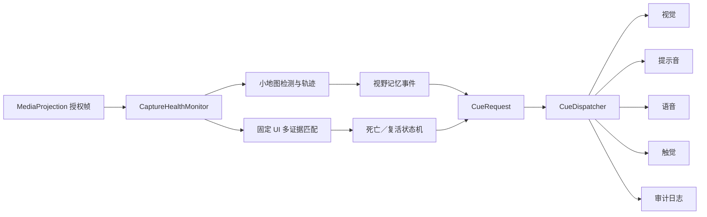

# 听野端侧事件感知与可靠性增强技术方案

> 文档版本：1.1
> 更新日期：2026-09-30
> 当前状态：软件链路已接入；死亡／复活真实签名、独立留出集和实体机结果待补充

## 1. 目标与边界

本阶段增强三个直接服务于无障碍体验的基础能力：统一管理多通道提示、以轻量视觉识别玩家死亡／复活状态，以及在 Android 截屏帧中断时进行有限恢复。

本方案描述的本地事件与玩家状态链路只转换屏幕已经展示的信息，不读取游戏内存、不注入、不模拟触控、不提供路线、团战或资源争夺建议；小地图画面和状态签名均在设备本地处理。本方案不包含网络图像处理。0.4.0 的选用式语音/画面助手是独立的默认关闭路径：用户分别开启后，语音片段或当前帧会经配置的 HTTPS 网关发往对应识别服务；具体数据范围见[0.4.0 Goal](../../validation/GOAL_0.4.0_2026-10-03.md)。

## 2. 总体数据流



三层职责彼此分离：识别器只报告事实，事件状态机只确认状态转换，输出调度器决定当前是否值得打扰以及使用哪些通道。

## 3. 统一输出调度

### 3.1 事件模型

`CueRequest` 是所有输出的统一输入，包含会话 ID、事件 ID、稳定去重键、事件类别、优先级、产生及过期时间、请求通道、方向、短语和振动编码。

`CueDispatcher` 负责类别过滤、通道过滤、事件去重、过期丢弃、优先级队列和紧急语音抢占。待播放语音最多保留 8 条，同优先级按到达顺序处理；队列已满时，新事件只有在优先级更高时才能替换最低优先级中最早的事件。

| 事件 | 优先级 | 有效期 |
| --- | ---: | ---: |
| 死亡、截屏授权终止 | 100 | 2000 ms |
| 小地图近区占用（`NEAR_ZONE`；原“可靠危险接近”预留档位） | 80 | 1200 ms |
| 雷达暂停／恢复提示音（`NEAR_ZONE`，仅提示音） | 20 | 2000 ms |
| 复活 | 60 | 2500 ms |
| 敌人出现 | 40 | 800 ms |
| 非紧急系统状态 | 20 | 3000 ms |

只有优先级 100 的事件可以中断正在播放的低优先级语音。系统不主动修改媒体音量；TTS 不可用时，允许的提示音和触觉仍可继续工作。

### 3.2 用户设置

- **精简**：死亡／复活使用语音和触觉，视野记忆仅使用视觉。
- **标准**：稳定的敌人 APPEAR 使用一次中性短音和可选视觉标记；DISAPPEAR 只保留残影，语音和触觉关闭；玩家状态使用语音和触觉。
- **详细**：APPEAR 可增加“发现新的敌方头像”短语；玩家位置不可靠时仍不附加方位，连续 TRACK 与 DISAPPEAR 不播报。
- **自定义**：用户可以独立关闭四个输出通道或四个事件类别。

小地图 APPEAR 的会话级最短声音间隔为 15 秒。危险接近类别默认关闭，直到系统能够可靠获得我方位置、敌我距离和接近方向。

## 4. 死亡／复活轻量识别

### 4.1 配置与特征

GameProfile 顶层保持 `schema_version: 1`。可选的 `state_recognition.player_life` 使用独立 schema：

```json
{
  "state_recognition": {
    "player_life": {
      "schema": "mapassist.player_life_signatures",
      "schema_version": 1,
      "enabled": false,
      "roi": [0.0, 0.0, 1.0, 1.0],
      "thresholds": {
        "max_dhash_distance": 8,
        "max_luma_mae": 0.12,
        "max_chroma_mae": 0.12,
        "min_state_margin": 0.06
      },
      "dead": [],
      "alive": []
    }
  }
}
```

示例数值只说明字段形状，不是可直接启用的游戏参数。每个状态至少需要 3 个经过授权的签名，否则 Android 和离线回放都保持该识别器关闭。

每个签名包含 64 位 dHash、标准化 `8×8` 亮度结构、`4×4` Cb/Cr 色彩摘要和裁剪 SHA-256。单帧必须同时通过汉明距离、亮度误差、色彩误差和类别间距门限；证据不足或两类过近时输出 `UNKNOWN`。

### 4.2 状态机

```text
UNKNOWN + ALIVE 2/3 帧确认 → ALIVE，不提示
UNKNOWN/ALIVE + DEAD 2/3 帧确认 → DEAD，提示一次
DEAD + DEAD → 静默
DEAD + ALIVE 2/3 帧确认 → ALIVE，提示复活一次
无匹配或歧义 → 保持原状态
暂停、旋转、采集恢复、长帧中断 → UNKNOWN
```

原生 ABI v7 定义 `MA_PLAYER_DEAD` 和 `MA_PLAYER_ALIVE`。Android 与 Python 离线回放使用同一个 C++ 匹配器和状态机，避免评测算法与 APK 不一致。

### 4.3 校准门禁

`python -m mapassist.player_state_calibrate` 接受死亡、存活截图和归一化 ROI，生成签名并执行逐样本留一验证。工具只在开发集 precision ≥95%、recall ≥90% 时输出可启用配置。阈值冻结后还必须在未参与选择的完整对局上进行事件级留出评测；加载页、设置页和结算页作为强制负样本。

公开配置默认 `enabled: false`，真实录像、截图和签名不进入公开仓库。

## 5. MediaProjection 健康监控

`CaptureHealthMonitor` 分开记录最后收到帧和最后处理帧，避免 12 FPS 节流被误判为断流。

- 启动宽限期为 2 秒；非暂停状态下 1 秒没有新帧进入 `STARVED`。
- 恢复延迟依次为 0.5、1、2 秒，最多连续尝试 3 次。
- 恢复只重建 `ImageReader` 并重新绑定现有 `VirtualDisplay` 的 Surface，不重复使用 Android 14 的一次性授权创建新 VirtualDisplay。
- 健康收到帧 10 秒后清零连续失败计数。
- 系统撤销授权进入 `REVOKED`，不自动恢复；三次失败进入 `FAILED` 并要求重新授权。
- 黑屏仍使用独立持续黑帧检测，不与无帧状态混淆。

每次新建 ImageReader 都递增 generation。旧 reader 的延迟回调会被丢弃；恢复、旋转和暂停均重置原生事件状态及提示层，防止技术中断被解释成敌人消失、玩家死亡或复活。

## 6. 审计格式

兼容期内继续输出旧 `CueEvent`，并新增：

- `CueDispatch`：请求类别、优先级、请求／接受通道、调度结果和丢弃原因；
- `CuePlayback`：具体通道的开始、完成、失败、过期或抢占时间；
- `CaptureHealth`：健康状态、原因、尝试次数、reader generation 和距离最后帧的时间。

日志解析器继续读取 schema v1；存在新记录时输出 schema v2。schema v2 的音频延迟证据只包含真正产生 `TONE/SPEECH STARTED` 的事件，视觉-only事件不会被错误计为缺失音频。

## 7. 验收要求与证据边界

自动测试覆盖输出优先级、FIFO、过期、去重、队列上限、抢占；玩家初始 ALIVE 静默、单次死亡、单次复活和重置；断流恢复、撤权不恢复和旧 reader 隔离；Android／Python 原生行为一致性。

发布前还需要：

1. 独立留出集死亡／复活事件 precision ≥95%、recall ≥90%、P95 转换延迟 ≤500 ms；
2. 加载页和结算页负样本中不产生伪死亡或伪复活；
3. Android 13 与 Android 14 实体机分别连续运行至少 15 分钟；
4. 记录处理帧率、游戏帧率变化、电量、温度和实际提示延迟。

当前仓库已经实现软件接口、默认关闭配置、校准工具和自动测试。由于公开仓库不包含真实状态签名，也尚未在本次变更中完成实体机测量，因此不能把死亡／复活能力标记为已通过发布门禁。
