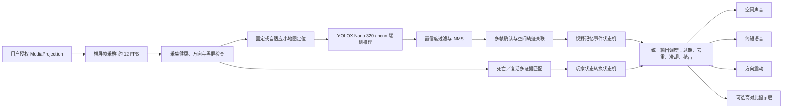

# 听野（SenseField）技术方案

> 参赛项目：面向低视力玩家的实时游戏信息无障碍转换层
> 文档版本：1.1
> 更新日期：2026-09-29
> 当前阶段：Android 实验原型，核心识别器默认关闭，尚未完成实体机最终验收

## 1. 方案摘要

听野是一套运行在 Android 端的实时游戏信息无障碍转换系统。系统在用户明确授权后读取屏幕画面，在设备本地识别小地图中的关键事件，并通过空间声音、简短语音、方向震动和可选高对比提示层重新表达信息。

本方案解决的不是“如何替玩家做出更好的战术决策”，而是：

> 如何把游戏界面已经向玩家展示、但因有效视野有限、注意力受限或认知负荷较高而难以持续感知的信息，及时、克制地转换到可感知通道。

系统不读取游戏内存，不注入游戏进程，不模拟触控，不执行移动、攻击或技能操作，也不输出“去打龙”“走哪一路”等策略指令。玩家始终保留判断权和操作权。

第一版 MVP 聚焦四类能力，其中前两类已经接入实验原型：

| 感知事件 | 输入信息 | 无障碍输出 | 当前状态 |
| --- | --- | --- | --- |
| 敌人出现 | 小地图敌方头像 | 空间提示音、高对比标记、方向震动 | 已实现实验版 |
| 敌人消失 | 头像由可见转为丢失 | 最后位置、最后移动方向、条件语音、方向震动 | 已实现实验版 |
| 危险接近 | 敌我相对位置与接近速度 | 高优先级方向震动与短语音 | 等待我方位置检测，当前关闭 |
| 关键状态变化 | 死亡／复活固定 UI | 语音与触觉 | 软件链路已接入，真实签名与留出集待完成 |

## 2. 用户问题与设计原则

部分低视力玩家能够看清角色附近的中央区域，却难以同时观察屏幕边缘和小地图。普通的画面放大还会进一步缩小同一时刻可见的范围；传统读屏又难以跟上实时变化的图标和战局信息。

听野遵循五项设计原则：

1. **补信息，不代决策**：只表达“发生了什么”，不告诉玩家“应该怎么打”。
2. **少而关键**：识别到信息不等于立即打扰用户；重复、过时和低相关事件应被合并或静默。
3. **多通道重编码**：允许视觉、听觉和触觉互补，避免把全部信息挤进语音通道。
4. **端侧与最小数据**：屏幕画面只在授权后于本机处理，默认不上传、不保存。
5. **证据边界清晰**：开发集、留出集、模拟器和实体机结论分别记录，未通过验证的能力默认关闭。

## 3. 产品技术边界

听野的处理范围限于玩家已经能够从当前屏幕画面获得的信息。系统只确认可观察事件、判断信息新鲜度与打扰成本，再将事件转换为视觉、听觉或触觉线索；不推断打法，也不提供下一步操作建议。

视野记忆（Vision Memory）保存敌人头像从出现到消失期间的最后位置、最后移动方向和消失时间，使用户不必持续注视或记忆小地图。该能力属于界面信息的无障碍重编码，不扩展玩家可获取的信息边界。

## 4. 总体技术架构



系统由六个核心层组成：

### 4.1 屏幕采集层

- 使用 Android `MediaProjection`，每次会话均由用户主动授权整个屏幕。
- 前台服务管理采集生命周期，支持开始、暂停、恢复、停止和系统撤销授权。
- 通过 `ImageReader` 接收 RGBA 帧，以约 12 FPS 采样，避免按屏幕刷新率重复推理。
- 仅处理横屏画面；连续黑屏会停止采集，防止对受保护或不可用内容空转。
- 屏幕旋转和采集尺寸变化会重建读取器并重置事件状态，避免产生伪“敌人消失”。

### 4.2 小地图定位层

当前稳定路径使用配置文件中的固定归一化 ROI。实验性自适应定位器使用：

- 黑边内容区归一化；
- 相对短边的布局锚点；
- 位置、缩放和宽高比搜索；
- 两帧确认、短时保持和周期重定位；
- 粗略布局框与定位框并集修正，降低边缘目标被裁掉的风险。

自适应定位已完成离线链路验证，但会改变旧检测模型的裁剪分布，因此未作为 APK 默认路径。

### 4.3 视觉识别层

小地图敌方头像使用单类 YOLOX Nano 320 模型：

- 输入：小地图 RGBA 裁剪；
- 预处理：RGBA 转 BGR、等比例缩放至 `320×320`、右侧和下侧填充 114；
- 推理：ncnn Android 静态运行时，CPU 两线程；
- 解码：strides `8/16/32`，`objectness × class`；
- 旧固定 ROI 候选阈值（低清历史，已退役）：confidence `0.19`，NMS IoU `0.5`；
- 输出：敌方头像框、置信度、时间戳和相对方位。

模型在 Android JNI 中直接完成裁剪、推理、解码和坐标还原，避免把完整帧复制到 Java 层。

### 4.4 事件引擎层

单帧检测结果不能直接触发提示。原生 C++ 事件引擎负责：

- 置信度门限；
- 过期观察丢弃；
- `2/3` 帧确认；
- 最近邻空间轨迹关联；
- 全局提示间隔和同类冷却；
- 高优先级事件抢占；
- 采样中断时状态重置。

主流程只传递结构化事件，不保存屏幕图像。

### 4.5 相关性过滤层

无障碍系统不能“识别到就播报”，否则过量提示本身会成为新的障碍。当前原型采用可验证的保守过滤：

- 视觉标记必须通过置信度与连续帧确认；
- APPEAR / DISAPPEAR 才能触发触觉，TRACK 保持静默；
- 消失语音必须具有可靠移动向量；
- 触觉冷却 500 ms，视野记忆语音冷却 2 s；
- 同类小地图声音设置独立冷却，较高优先级事件可以抢占低优先级事件；
- 过期事件不播放，即使音频资源稍后才加载完成。

完整的“危险接近”相关性评分需要我方位置、敌我距离、接近速度、危险区域、交战状态、用户偏好和信息新鲜度：

```text
relevance = 距离 × 接近速度 × 危险区域 × 交战状态 × 用户偏好 × 新鲜度
```

当前尚无可靠的我方位置检测，因此危险接近事件保持关闭。系统不会仅因检测到敌方英雄或打野就发出全局危险提醒。

### 4.6 无障碍输出层

- **空间声音**：左右方位通过声道增益表达，上下方位使用预生成短语音补充。
- **事件语音**：只播报仍然新鲜且具有可靠方向的信息，例如“左上敌人消失，向下移动”。
- **方向震动**：用短—长、长—短等节奏编码方向；手机通常只有单个振动器，因此这是节奏编码，不宣称物理左右振动。
- **高对比提示层**：红色圆环表示当前可见目标；进入 DISAPPEAR 后，消失目标显示最后位置、斜线和移动箭头，在 4 秒内渐隐。
- 提示层使用 `TYPE_APPLICATION_OVERLAY`，不获取焦点、不接收触控，并设置安全窗口标记；不同设备是否能完全从 MediaProjection 中排除仍需实体机确认。

### 4.7 玩家状态与采集可靠性

- 死亡／复活使用 dHash、亮度结构和色彩摘要共同判断，并以 `2/3` 帧确认状态转换；证据冲突时保持 UNKNOWN。
- 初次建立 ALIVE 状态不播报，只有确认死亡和死亡后的确认复活各提示一次。
- MediaProjection 帧断流与持续黑屏分开处理；断流只重建 ImageReader 和 Surface，采用 0.5、1、2 秒有限恢复，不申请 AccessibilityService。
- 所有输出经统一 `CueDispatcher` 处理，支持精简、标准、详细三个预设以及通道／类别高级开关。
- 详细接口、配置与门禁见 `docs/端侧事件感知与可靠性增强技术方案.md`。

## 5. 核心能力：视野记忆

视野记忆把瞬时检测转换成可持续、可解释的事件历史。

```text
候选目标
   │ 三帧中至少命中两帧
   ▼
APPEAR ──持续检测──▶ TRACK
                         │ 连续丢失三帧
                         ▼
                    DISAPPEAR
                         │
                         ├─ 最后位置
                         ├─ 最后速度向量
                         └─ LAST_DIRECTION 残影 4 秒
```

关键实现规则：

1. 目标中心点使用最近邻距离关联到最多 8 条轨迹。
2. 位置、框尺寸和速度使用指数平滑，降低检测框抖动。
3. 小于归一化阈值的位移视为检测抖动，不输出移动方向。
4. 连续漏检 1～2 帧仍保持可见状态，防止头像特效或压缩噪声造成闪烁。
5. 第 3 个连续漏检帧产生一次 DISAPPEAR 事件；后续残影刷新不重复播报。
6. 确认进入 DISAPPEAR 后，最后位置保留 4 秒并按时间逐渐降低透明度；确认丢失前的短暂漏检不消耗这段时间。
7. 暂停、旋转或采样长时间中断直接清空轨迹，不把技术中断解释成游戏事件。
8. 自适应小地图定位器处于 SEARCHING 时静默清空小地图轨迹；定位重新确认后再建立轨迹，不把 ROI 暂时不可用解释成敌人消失。
9. 目标进入 DISAPPEAR 后在残影期内重新出现时，清除旧移动向量与播报状态，并重新通过 `2/3` 帧确认后产生新的 APPEAR。

## 6. 数据与模型流程

### 6.1 数据治理

- 私有录像、抽帧、标签和实验产物由 `.gitignore` 排除，不进入公开仓库。
- 数据按整场对局划分 train / validation / test，禁止同一录像跨分组。
- 标注工具支持多人领取、租约、乐观锁、框编辑、负样本和非对局画面排除。
- 独立留出抽样不读取模型预测，避免按预测结果挑选容易样本。

### 6.2 训练与转换

```text
授权录像 → 预测无关抽样 → 人工框标注 → COCO 导出
       → YOLOX Nano 训练 → 冻结权重 → ONNX / ncnn 转换
       → TorchScript / ncnn 数值一致性检查 → APK 资产哈希校验
```

模型文件、ncnn 依赖包、APK 内 profile 和离线预测均记录 SHA-256。构建阶段会校验模型资产，验收门禁会再次核对安装 APK 与离线评测是否使用同一配置。

## 7. 当前验证结果与证据边界

以下数据用于说明当前技术状态，不代表产品已经通过最终验收：

| 验证项 | 当前结果 | 结论 |
| --- | --- | --- |
| YOLOX Nano 320 开发验证 | precision 90.50%、recall 72.65%、F1 80.60% | 开发集召回未达 80%目标 |
| video7 人机局盲测 | precision 65.57%、recall 63.49%、F1 64.52% | 未通过发布门禁 |
| video8 旧冻结运行（ROI 截断污染的历史 crop-relative 数值） | 旧流程记录 precision 58.84%、recall 80.47%、方向准确率 96.86% | 固定 ROI 截断右侧目标；数值只对应不完整旧裁剪，不能作为完整地图效果或召回结论；需新留出数据 |
| 固定模型到 ncnn 一致性 | 30 张裁剪最大原始输出误差 0.0004493 | 低于 0.0005 门限 |
| Android 13/14 模拟器 | 截屏、横屏采集、ncnn 推理、暂停／恢复／停止均跑通 | 不能替代实体机发声、发热和功耗测试 |
| 当前 Android 构建 | `assembleDebug` 与 `lintDebug` 通过 | 代码和资源可生成 debug APK |
| 视野记忆状态机 | APPEAR、保持、DISAPPEAR、4 秒清除单元测试通过 | 尚需真实对局事件级标注和用户测试 |

发布目标门禁为：逐类 precision ≥90%、recall ≥80%、方向准确率 ≥90%，实体 Android 13/14 连续运行至少 15 分钟，实际发声端到端 P95 ≤250 ms。当前实验识别器未通过完整门禁，因此默认关闭。

## 8. 性能设计

为控制耗电、发热和游戏帧率影响，原型采用以下措施：

- 推理区域限制在小地图 ROI，不对完整屏幕运行大模型；
- 使用 Nano 级单类检测器与固定 `320×320` 输入；
- 采样约 12 FPS，而不是跟随 60/90/120 Hz 屏幕刷新率；
- ncnn CPU 两线程，关闭 Vulkan 和 FP16 实验路径，优先保证设备兼容与可复现性；
- Java 层不复制完整画面，JNI 直接读取 `ImageReader` 的直接缓冲区；
- 声音资源异步加载，事件过期后不补播；
- Overlay 只绘制少量矢量图形，不保存历史截图。

实体机验收需记录：持续处理帧率、最大帧间隔、端到端提示延迟、游戏帧率变化、电量变化和设备温度；所有结论均以听野自身测量为准。

## 9. 隐私、安全与公平边界

1. 仅使用 Android 官方截屏授权，不申请读取游戏进程或无障碍点击权限。
2. 所有识别在设备本地完成；运行时不上传、不保存游戏画面。
3. 不注入、不改包、不读内存、不模拟触控，不产生任何游戏操作。
4. 只解释界面已经向玩家展示的信息，不获取隐藏信息。
5. 实验识别器、提示层和未通过验证的配置默认关闭。
6. 实际使用前需要确认游戏厂商服务条款、赛事规则及辅助功能允许范围。
7. 研究录像与标注必须获得授权，公开仓库仅保留代码、脱敏文档、示例 schema 及获准公开的模型资产。

## 10. 技术创新点

### 10.1 从单帧识别转向事件记忆

系统不是简单框出头像，而是维护出现、移动、消失和最后方向，使瞬时信息能够被低视力玩家持续感知。

### 10.2 从“识别即提醒”转向克制的事件过滤

多帧确认、轨迹去重、过期丢弃、冷却和优先级共同决定是否打扰用户。缺少敌我距离等关键证据时宁可静默，不用固定规则伪造危险判断。

### 10.3 同一事件的多模态可替换表达

视觉、声音和触觉承载不同信息：视觉保留历史，声音表达方位，语音解释状态变化，触觉用于不占据听觉通道的短促提醒。后续可以按用户需求关闭任一通道。

### 10.4 可审计的端侧验证链路

从数据分组、模型哈希、APK 资产到真机 `CueEvent` 日志和外部录音均可关联，避免用开发集成绩、模拟器结果或不同模型替代最终验收证据。

## 11. 风险与应对

| 风险 | 影响 | 当前应对 |
| --- | --- | --- |
| 小地图误报较高 | 错误提示增加认知负担 | 实验开关默认关闭；扩充困难负样本；新留出对局复测 |
| 不同分辨率和刘海／黑边 | ROI 偏移或漏检 | 归一化配置；自适应定位器；旋转后重置 |
| 短时漏检造成闪烁 | 频繁出现／消失 | `2/3` 帧确认与连续三帧丢失判定 |
| 语音过量 | 遮挡游戏声音和队伍交流 | 可靠运动门限、冷却、优先级和静默降级 |
| Overlay 被二次截取 | 影响下一帧识别 | 安全窗口标记；矢量样式与检测目标解耦；实体机验证 |
| 持续推理造成耗电与发热 | 影响游戏体验 | ROI 推理、12 FPS、Nano 模型、两线程；15 分钟真机测量 |
| 被误解为竞技外挂 | 合规与传播风险 | 不读内存、不控制游戏、不做策略建议；清晰公开能力边界 |

## 12. 现场演示流程

建议现场 Demo 只展示可解释的无障碍闭环：

1. 用户主动开启“视野记忆”并授权截屏与非交互提示层。
2. 敌方头像首次出现在小地图左上：显示红色高对比标记，并给出方向提示音／震动。
3. 头像持续移动：视觉标记跟随，系统保持静默，不重复打扰。
4. 头像连续三帧消失：原位置显示带斜线残影和最后移动箭头，播报“左上敌人消失，向下移动”。
5. 残影在 4 秒内逐渐淡出；系统不输出下一步战术建议。
6. 展示暂停或撤销截屏后所有状态和提示立即清除。

Demo 需要同时说明：识别器仍处于实验阶段；演示证明交互闭环成立，不等于准确率、功耗和实体机最终门禁已经通过。

## 13. 后续计划

### 第一阶段：完成视野记忆验收

- 在新的、未参与调参的真人对局上做逐帧与事件级盲测；
- 降低小地图误报并冻结新模型；
- Android 13/14 实体机各完成至少 15 分钟连续运行；
- 测量延迟、游戏帧率、温度、电量与实际发声；
- 邀请目标用户验证提示清晰度、认知负担和通道偏好。

### 第二阶段：实现危险接近

- 建立我方英雄位置数据与检测器；
- 计算敌我相对距离和接近速度；
- 标注危险区域和交战状态；
- 通过用户可调阈值实现 relevance score；
- 未取得完整输入时保持视觉提示或静默。

### 第三阶段：验收死亡／复活关键状态

- 使用授权录像生成私有死亡／存活签名并冻结阈值；
- 在独立完整对局上验证事件 precision、recall 和转换延迟；
- 完成 Android 13/14 断流恢复、功耗、温度和游戏帧率测量；
- 门禁通过后再评估血量和技能冷却，不把单一 UI 参数误称为通用方案。

## 14. 代码与证据索引

| 模块 | 位置 |
| --- | --- |
| Android 截屏与服务生命周期 | `android/app/src/main/java/org/openrd/mapassist/CaptureService.java` |
| 视觉、语音和触觉输出 | `MinimapOverlay.java`、`CuePlayer.java` |
| Android ncnn 推理与 JNI | `android/app/src/main/cpp/native_bridge.cpp` |
| 原生检测与事件状态机 | `native/src/mapassist.cpp`、`native/include/mapassist.h` |
| 小地图模型配置 | `profiles/hok_minimap_development.json` |
| 训练、转换与评测 | `training/`、`python/mapassist/` |
| 当前验证状态 | `validation/STATUS.md` |
| 模型接入证据 | `validation/MODEL_PIPELINE.md` |
| 视野记忆专项设计 | `docs/视野记忆.md` |
| 事件调度、玩家状态与采集恢复 | `docs/端侧事件感知与可靠性增强技术方案.md` |

---

听野的核心主张是：技术价值不在于识别到更多信息，而在于把正确、及时且与用户有关的信息，以不会形成新障碍的方式重新表达出来。
